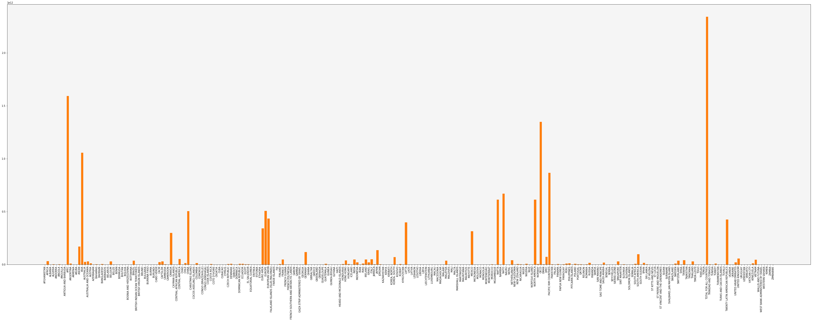
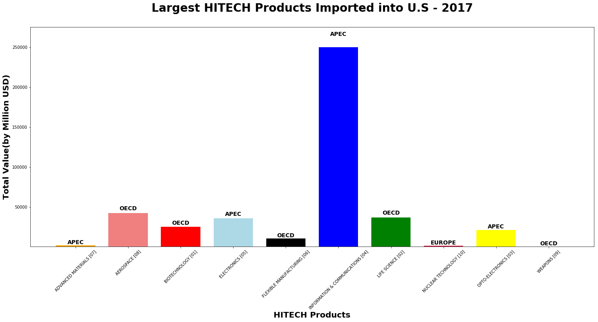
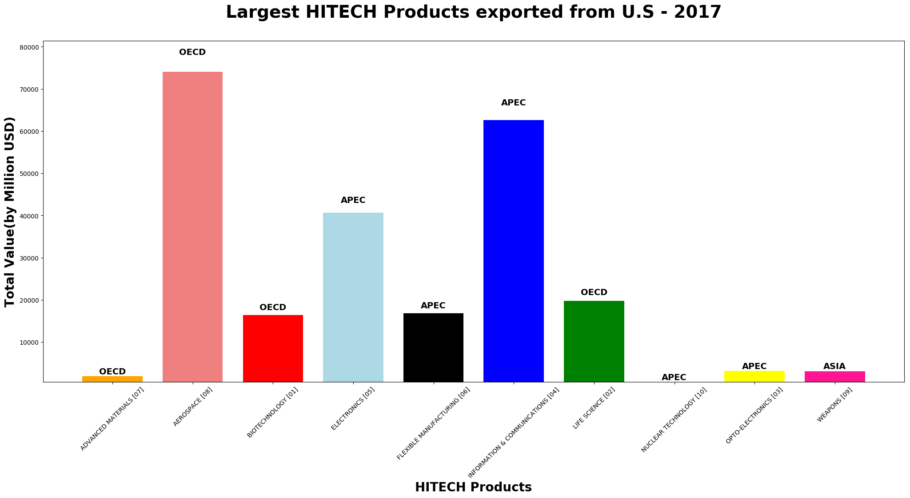
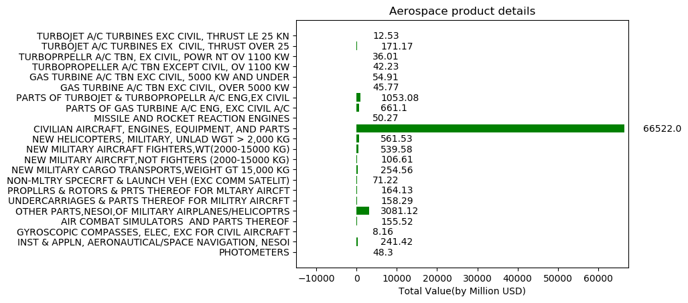

```python
!pip install census
```

    Requirement already satisfied: census in c:\users\vpdinh\anaconda3\lib\site-packages (0.8.7)
    Requirement already satisfied: future in c:\users\vpdinh\anaconda3\lib\site-packages (from census) (0.16.0)
    Requirement already satisfied: requests>=1.1.0 in c:\users\vpdinh\anaconda3\lib\site-packages (from census) (2.18.4)
    Requirement already satisfied: chardet<3.1.0,>=3.0.2 in c:\users\vpdinh\anaconda3\lib\site-packages (from requests>=1.1.0->census) (3.0.4)
    Requirement already satisfied: idna<2.7,>=2.5 in c:\users\vpdinh\anaconda3\lib\site-packages (from requests>=1.1.0->census) (2.6)
    Requirement already satisfied: urllib3<1.23,>=1.21.1 in c:\users\vpdinh\anaconda3\lib\site-packages (from requests>=1.1.0->census) (1.22)
    Requirement already satisfied: certifi>=2017.4.17 in c:\users\vpdinh\anaconda3\lib\site-packages (from requests>=1.1.0->census) (2018.4.16)
    


```python
import numpy as np
import pandas as pd
import matplotlib.pyplot as plt
import requests
from census import Census
import json

# Census API Key
from config import ckey
c = Census(ckey)
```

# Getting export and import Data from NAICS - this part not relating to our Project


```python
url_import="https://api.census.gov/data/timeseries/intltrade/imports/naics?get=CTY_CODE,CTY_NAME,GEN_VAL_MO,GEN_VAL_YR&time=from+2017-01+to+2017-12"
url_export="https://api.census.gov/data/timeseries/intltrade/exports/naics?get=CTY_CODE,CTY_NAME,ALL_VAL_MO,ALL_VAL_YR&time=from+2017-01+to+2017-12"
export_data = requests.get(url_export).json()
import_data = requests.get(url_import).json()
#print(len(export_data))
#print(import_data)
#print(json.dumps(import_data, indent=4, sort_keys=True))
#print(export_data[19][1])

Export_countrycode=[]
Export_countryname=[]
Export_totalvalue=[]
Export_year_date_value=[]
Export_time=[]


Import_countrycode=[]
Import_countryname=[]
Import_totalvalue=[]
Import_year_date_value=[]
Import_time=[]
Country_grouping=""

print(export_data[1][0])

x=1
y=1
while x <len(export_data):
    if export_data[x][0]=="0001":
        Country_grouping = "OPEC"
    elif export_data[x][0]=="0003":
        Country_grouping = "EUROPEAN UNION"
    elif export_data[x][0]=="0014":
        Country_grouping = "PACIFIC RIM COUNTRIES"
    elif export_data[x][0]=="0017":
        Country_grouping = "CAFTA-DR"
    elif export_data[x][0]=="0020":
        Country_grouping = "NAFTA"
    elif export_data[x][0]=="0021":
        Country_grouping = "TWENTY LATIN AMERICAN REPUBLICS"
    elif export_data[x][0]=="0022":
        Country_grouping = "OECD"
    elif export_data[x][0]=="0023":
        Country_grouping = "NATO"
    elif export_data[x][0]=="0024":
        Country_grouping = "LAFTA"
    elif export_data[x][0]=="0025":
        Country_grouping = "EURO AREA"
    elif export_data[x][0]=="0026":
        Country_grouping = "APEC"
    elif export_data[x][0]=="0027":
        Country_grouping = "ASEAN"
    elif export_data[x][0]=="0028":
        Country_grouping = "CACM"
    elif export_data[x][0]=="1XXX":
        Country_grouping = "NORTH AMERICA"
    elif export_data[x][0]=="2XXX":
        Country_grouping = "CENTRAL AMERICA"
    elif export_data[x][0]=="3XXX":
        Country_grouping = "SOUTH AMERICA"
    elif export_data[x][0]=="4XXX":
        Country_grouping = "EUROPE"
    elif export_data[x][0]=="5XXX":
        Country_grouping = "ASIA"
    elif export_data[x][0]=="6XXX":
        Country_grouping = "AUSTRALIA AND OCEANIA"
    elif export_data[x][0]=="7XXX":
        Country_grouping = "AFRICA"
    elif import_data[x][0]=="":
        Country_grouping = export_data[x][0]
    else:
        Country_grouping = export_data[x][1]
        
    Export_countrycode.append(Country_grouping)
    Export_countryname.append(export_data[x][1])
    Export_totalvalue.append(int(export_data[x][2]))
    Export_year_date_value.append(int(export_data[x][3]))
    Export_time.append(export_data[x][4])
    x= x+1
Country_grouping=""
while y <len(import_data):
    if import_data[y][0]=="0001":
        Country_grouping = "OPEC"
    elif import_data[y][0]=="0003":
        Country_grouping = "EUROPEAN UNION"
    elif import_data[y][0]=="0014":
        Country_grouping = "PACIFIC RIM COUNTRIES"
    elif import_data[y][0]=="0017":
        Country_grouping = "CAFTA-DR"
    elif import_data[y][0]=="0020":
        Country_grouping = "NAFTA"
    elif import_data[y][0]=="0021":
        Country_grouping = "TWENTY LATIN AMERICAN REPUBLICS"
    elif import_data[y][0]=="0022":
        Country_grouping = "OECD"
    elif import_data[y][0]=="0023":
        Country_grouping = "NATO"
    elif import_data[y][0]=="0024":
        Country_grouping = "LAFTA"
    elif import_data[y][0]=="0025":
        Country_grouping = "EURO AREA"
    elif import_data[y][0]=="0026":
        Country_grouping = "APEC"
    elif import_data[y][0]=="0027":
        Country_grouping = "ASEAN"
    elif import_data[y][0]=="0028":
        Country_grouping = "CACM"
    elif import_data[y][0]=="1XXX":
        Country_grouping = "NORTH AMERICA"
    elif import_data[y][0]=="2XXX":
        Country_grouping = "CENTRAL AMERICA"
    elif import_data[y][0]=="3XXX":
        Country_grouping = "SOUTH AMERICA"
    elif import_data[y][0]=="4XXX":
        Country_grouping = "EUROPE"
    elif import_data[y][0]=="5XXX":
        Country_grouping = "ASIA"
    elif import_data[y][0]=="6XXX":
        Country_grouping = "AUSTRALIA AND OCEANIA"
    elif import_data[y][0]=="7XXX":
        Country_grouping = "AFRICA"
    elif import_data[y][0]=="":
        Country_grouping = import_data[y][0]
    else:
        Country_grouping = import_data[y][1]
    
    Import_countrycode.append(Country_grouping)
    Import_countryname.append(import_data[y][1])
    Import_totalvalue.append(int(import_data[y][2]))
    Import_year_date_value.append(int(import_data[y][3]))
    Import_time.append(import_data[y][4])
    y= y+1
export_df= pd.DataFrame({"Country Grouping":Export_countrycode,"Country Name":Export_countryname,"Total Value":Export_totalvalue,"Year to Date Total Value":Export_year_date_value,"Time":Export_time})
import_df= pd.DataFrame({"Country Grouping":Import_countrycode,"Country Name":Import_countryname,"Total Value":Import_totalvalue,"Year to Date Total Value":Import_year_date_value,"Time":Import_time})

import_df.head(15)
```

    
    


<div>
<style scoped>
    .dataframe tbody tr th:only-of-type {
        vertical-align: middle;
    }

    .dataframe tbody tr th {
        vertical-align: top;
    }

    .dataframe thead th {
        text-align: right;
    }
</style>
<table border="1" class="dataframe">
  <thead>
    <tr style="text-align: right;">
      <th></th>
      <th>Country Grouping</th>
      <th>Country Name</th>
      <th>Time</th>
      <th>Total Value</th>
      <th>Year to Date Total Value</th>
    </tr>
  </thead>
  <tbody>
    <tr>
      <th>0</th>
      <td></td>
      <td>TOTAL FOR ALL COUNTRIES</td>
      <td>2017-01</td>
      <td>185671930029</td>
      <td>185671930029</td>
    </tr>
    <tr>
      <th>1</th>
      <td></td>
      <td>TOTAL FOR ALL COUNTRIES</td>
      <td>2017-02</td>
      <td>169391887793</td>
      <td>355063817822</td>
    </tr>
    <tr>
      <th>2</th>
      <td></td>
      <td>TOTAL FOR ALL COUNTRIES</td>
      <td>2017-03</td>
      <td>194258307901</td>
      <td>549322125723</td>
    </tr>
    <tr>
      <th>3</th>
      <td></td>
      <td>TOTAL FOR ALL COUNTRIES</td>
      <td>2017-04</td>
      <td>186149627407</td>
      <td>735471753130</td>
    </tr>
    <tr>
      <th>4</th>
      <td></td>
      <td>TOTAL FOR ALL COUNTRIES</td>
      <td>2017-05</td>
      <td>200596866806</td>
      <td>936068619936</td>
    </tr>
    <tr>
      <th>5</th>
      <td></td>
      <td>TOTAL FOR ALL COUNTRIES</td>
      <td>2017-06</td>
      <td>198447405018</td>
      <td>1134516024954</td>
    </tr>
    <tr>
      <th>6</th>
      <td></td>
      <td>TOTAL FOR ALL COUNTRIES</td>
      <td>2017-07</td>
      <td>192043641101</td>
      <td>1326559666055</td>
    </tr>
    <tr>
      <th>7</th>
      <td></td>
      <td>TOTAL FOR ALL COUNTRIES</td>
      <td>2017-08</td>
      <td>201820890679</td>
      <td>1528380556734</td>
    </tr>
    <tr>
      <th>8</th>
      <td></td>
      <td>TOTAL FOR ALL COUNTRIES</td>
      <td>2017-09</td>
      <td>194796034042</td>
      <td>1723176590776</td>
    </tr>
    <tr>
      <th>9</th>
      <td></td>
      <td>TOTAL FOR ALL COUNTRIES</td>
      <td>2017-10</td>
      <td>210731917372</td>
      <td>1933908508148</td>
    </tr>
    <tr>
      <th>10</th>
      <td></td>
      <td>TOTAL FOR ALL COUNTRIES</td>
      <td>2017-11</td>
      <td>207769719952</td>
      <td>2141678228100</td>
    </tr>
    <tr>
      <th>11</th>
      <td></td>
      <td>TOTAL FOR ALL COUNTRIES</td>
      <td>2017-12</td>
      <td>200284506369</td>
      <td>2341962734469</td>
    </tr>
    <tr>
      <th>12</th>
      <td>GREENLAND</td>
      <td>GREENLAND</td>
      <td>2017-01</td>
      <td>181540</td>
      <td>181540</td>
    </tr>
    <tr>
      <th>13</th>
      <td>GREENLAND</td>
      <td>GREENLAND</td>
      <td>2017-02</td>
      <td>528938</td>
      <td>710478</td>
    </tr>
    <tr>
      <th>14</th>
      <td>GREENLAND</td>
      <td>GREENLAND</td>
      <td>2017-03</td>
      <td>844826</td>
      <td>1555304</td>
    </tr>
  </tbody>
</table>
</div>


```python
group_import = import_df.groupby(['Country Name'])
total_airvalue = group_import['Total Value'].sum()


group_export = export_df.groupby(['Country Name'])
total_totalvalue = group_export['Total Value'].sum()

im=total_airvalue.to_frame().reset_index()
#df = df.rename(columns= {0: 'list'})
#df.index.name = 'index'
ex= total_totalvalue.to_frame().reset_index()
```


```python
#check_data = b[b['Country Name']=='CUBA']
#check_data
consol_data = pd.merge(im,ex, how="outer")
consol_data.to_csv("import&export.csv")
```


```python
ax = plt.figure(figsize=(60,20)).add_subplot(111)
#Set background color,size and space of bar charts
ax.patch.set_facecolor('whitesmoke')
ax.bar(consol_data['Country Name'],consol_data['Total Value'])
ax.bar(consol_data['Country Name'],consol_data['Total Value'])
plt.xticks(rotation=90)
plt.show()
```





# Main part for the project, getting HITECH product types imported to U.S in 2017


```python
#Retrieve data for HITECH
url_hitechim = "https://api.census.gov/data/timeseries/intltrade/imports/hitech?get=CTY_CODE,CTY_NAME,HITECH,HITECH_DESC,GEN_VAL_MO,GEN_VAL_YR&time=2017&key=f71e81f058685a925a2f209f4ae23944770802fa"
import_hitechdata = requests.get(url_hitechim).json()
#export_hitechdata= requests.get(url_hitechex).json()
#print(json.dumps(export_hitechdata, indent=4, sort_keys=True))
Import_hicountrycode=[]
Import_hicountryname=[]
Import_hitechcode=[]
Import_hitechname=[]
Import_hitotalvalue=[]
Import_hiyear_date_value=[]
Import_hitime=[]

i=1
while i <len(import_hitechdata):
    Import_hicountrycode.append(import_hitechdata[i][0])
    Import_hicountryname.append(import_hitechdata[i][1])
    Import_hitechcode.append(import_hitechdata[i][2])
    Import_hitechname.append(import_hitechdata[i][3])
    Import_hitotalvalue.append(int(import_hitechdata[i][4]))
    Import_hiyear_date_value.append(int(import_hitechdata[i][5]))
    Import_hitime.append(import_hitechdata[i][6])
    i= i+1

import_hitechdata_df= pd.DataFrame({"Country Code":Import_hicountrycode,"Country Name":Import_hicountryname,"Hitech code":Import_hitechcode,"Hitech Name":Import_hitechname,"Total Value":Import_hitotalvalue,"Year to Date Total Value":Import_hiyear_date_value,"Time":Import_hitime})

import_hitechdata_df.head(50)
```


<div>
<style scoped>
    .dataframe tbody tr th:only-of-type {
        vertical-align: middle;
    }

    .dataframe tbody tr th {
        vertical-align: top;
    }

    .dataframe thead th {
        text-align: right;
    }
</style>
<table border="1" class="dataframe">
  <thead>
    <tr style="text-align: right;">
      <th></th>
      <th>Country Code</th>
      <th>Country Name</th>
      <th>Hitech Name</th>
      <th>Hitech code</th>
      <th>Time</th>
      <th>Total Value</th>
      <th>Year to Date Total Value</th>
    </tr>
  </thead>
  <tbody>
    <tr>
      <th>0</th>
      <td></td>
      <td>TOTAL FOR ALL COUNTRIES</td>
      <td>TOTAL FOR ALL COMMODITIES</td>
      <td></td>
      <td>2017-01</td>
      <td>185671930029</td>
      <td>185671930029</td>
    </tr>
    <tr>
      <th>1</th>
      <td></td>
      <td>TOTAL FOR ALL COUNTRIES</td>
      <td>TOTAL FOR ALL COMMODITIES</td>
      <td></td>
      <td>2017-02</td>
      <td>169391887793</td>
      <td>355063817822</td>
    </tr>
    <tr>
      <th>2</th>
      <td></td>
      <td>TOTAL FOR ALL COUNTRIES</td>
      <td>TOTAL FOR ALL COMMODITIES</td>
      <td></td>
      <td>2017-03</td>
      <td>194258307901</td>
      <td>549322125723</td>
    </tr>
    <tr>
      <th>3</th>
      <td></td>
      <td>TOTAL FOR ALL COUNTRIES</td>
      <td>TOTAL FOR ALL COMMODITIES</td>
      <td></td>
      <td>2017-04</td>
      <td>186149627407</td>
      <td>735471753130</td>
    </tr>
    <tr>
      <th>4</th>
      <td></td>
      <td>TOTAL FOR ALL COUNTRIES</td>
      <td>TOTAL FOR ALL COMMODITIES</td>
      <td></td>
      <td>2017-05</td>
      <td>200596866806</td>
      <td>936068619936</td>
    </tr>
    <tr>
      <th>5</th>
      <td></td>
      <td>TOTAL FOR ALL COUNTRIES</td>
      <td>TOTAL FOR ALL COMMODITIES</td>
      <td></td>
      <td>2017-06</td>
      <td>198447405018</td>
      <td>1134516024954</td>
    </tr>
    <tr>
      <th>6</th>
      <td></td>
      <td>TOTAL FOR ALL COUNTRIES</td>
      <td>TOTAL FOR ALL COMMODITIES</td>
      <td></td>
      <td>2017-07</td>
      <td>192043641101</td>
      <td>1326559666055</td>
    </tr>
    <tr>
      <th>7</th>
      <td></td>
      <td>TOTAL FOR ALL COUNTRIES</td>
      <td>TOTAL FOR ALL COMMODITIES</td>
      <td></td>
      <td>2017-08</td>
      <td>201820890679</td>
      <td>1528380556734</td>
    </tr>
    <tr>
      <th>8</th>
      <td></td>
      <td>TOTAL FOR ALL COUNTRIES</td>
      <td>TOTAL FOR ALL COMMODITIES</td>
      <td></td>
      <td>2017-09</td>
      <td>194796034042</td>
      <td>1723176590776</td>
    </tr>
    <tr>
      <th>9</th>
      <td></td>
      <td>TOTAL FOR ALL COUNTRIES</td>
      <td>TOTAL FOR ALL COMMODITIES</td>
      <td></td>
      <td>2017-10</td>
      <td>210731917372</td>
      <td>1933908508148</td>
    </tr>
    <tr>
      <th>10</th>
      <td></td>
      <td>TOTAL FOR ALL COUNTRIES</td>
      <td>TOTAL FOR ALL COMMODITIES</td>
      <td></td>
      <td>2017-11</td>
      <td>207769719952</td>
      <td>2141678228100</td>
    </tr>
    <tr>
      <th>11</th>
      <td></td>
      <td>TOTAL FOR ALL COUNTRIES</td>
      <td>TOTAL FOR ALL COMMODITIES</td>
      <td></td>
      <td>2017-12</td>
      <td>200284506369</td>
      <td>2341962734469</td>
    </tr>
    <tr>
      <th>12</th>
      <td></td>
      <td>TOTAL FOR ALL COUNTRIES</td>
      <td>NOT ADVANCED TECHNOLOGY [00]</td>
      <td>00</td>
      <td>2017-01</td>
      <td>151141435694</td>
      <td>151141435694</td>
    </tr>
    <tr>
      <th>13</th>
      <td></td>
      <td>TOTAL FOR ALL COUNTRIES</td>
      <td>NOT ADVANCED TECHNOLOGY [00]</td>
      <td>00</td>
      <td>2017-02</td>
      <td>139459252586</td>
      <td>290600688280</td>
    </tr>
    <tr>
      <th>14</th>
      <td></td>
      <td>TOTAL FOR ALL COUNTRIES</td>
      <td>NOT ADVANCED TECHNOLOGY [00]</td>
      <td>00</td>
      <td>2017-03</td>
      <td>157300367313</td>
      <td>447901055593</td>
    </tr>
    <tr>
      <th>15</th>
      <td></td>
      <td>TOTAL FOR ALL COUNTRIES</td>
      <td>NOT ADVANCED TECHNOLOGY [00]</td>
      <td>00</td>
      <td>2017-04</td>
      <td>151482417037</td>
      <td>599383472630</td>
    </tr>
    <tr>
      <th>16</th>
      <td></td>
      <td>TOTAL FOR ALL COUNTRIES</td>
      <td>NOT ADVANCED TECHNOLOGY [00]</td>
      <td>00</td>
      <td>2017-05</td>
      <td>162611215038</td>
      <td>761994687668</td>
    </tr>
    <tr>
      <th>17</th>
      <td></td>
      <td>TOTAL FOR ALL COUNTRIES</td>
      <td>NOT ADVANCED TECHNOLOGY [00]</td>
      <td>00</td>
      <td>2017-06</td>
      <td>158817500228</td>
      <td>920812187896</td>
    </tr>
    <tr>
      <th>18</th>
      <td></td>
      <td>TOTAL FOR ALL COUNTRIES</td>
      <td>NOT ADVANCED TECHNOLOGY [00]</td>
      <td>00</td>
      <td>2017-07</td>
      <td>154624580623</td>
      <td>1075436768519</td>
    </tr>
    <tr>
      <th>19</th>
      <td></td>
      <td>TOTAL FOR ALL COUNTRIES</td>
      <td>NOT ADVANCED TECHNOLOGY [00]</td>
      <td>00</td>
      <td>2017-08</td>
      <td>162348487217</td>
      <td>1237785255736</td>
    </tr>
    <tr>
      <th>20</th>
      <td></td>
      <td>TOTAL FOR ALL COUNTRIES</td>
      <td>NOT ADVANCED TECHNOLOGY [00]</td>
      <td>00</td>
      <td>2017-09</td>
      <td>154149932066</td>
      <td>1391935187802</td>
    </tr>
    <tr>
      <th>21</th>
      <td></td>
      <td>TOTAL FOR ALL COUNTRIES</td>
      <td>NOT ADVANCED TECHNOLOGY [00]</td>
      <td>00</td>
      <td>2017-10</td>
      <td>167329513038</td>
      <td>1559264700840</td>
    </tr>
    <tr>
      <th>22</th>
      <td></td>
      <td>TOTAL FOR ALL COUNTRIES</td>
      <td>NOT ADVANCED TECHNOLOGY [00]</td>
      <td>00</td>
      <td>2017-11</td>
      <td>161628420848</td>
      <td>1720893121688</td>
    </tr>
    <tr>
      <th>23</th>
      <td></td>
      <td>TOTAL FOR ALL COUNTRIES</td>
      <td>NOT ADVANCED TECHNOLOGY [00]</td>
      <td>00</td>
      <td>2017-12</td>
      <td>156430259510</td>
      <td>1877323381198</td>
    </tr>
    <tr>
      <th>24</th>
      <td></td>
      <td>TOTAL FOR ALL COUNTRIES</td>
      <td>BIOTECHNOLOGY [01]</td>
      <td>01</td>
      <td>2017-01</td>
      <td>2020598683</td>
      <td>2020598683</td>
    </tr>
    <tr>
      <th>25</th>
      <td></td>
      <td>TOTAL FOR ALL COUNTRIES</td>
      <td>BIOTECHNOLOGY [01]</td>
      <td>01</td>
      <td>2017-02</td>
      <td>2004005079</td>
      <td>4024603762</td>
    </tr>
    <tr>
      <th>26</th>
      <td></td>
      <td>TOTAL FOR ALL COUNTRIES</td>
      <td>BIOTECHNOLOGY [01]</td>
      <td>01</td>
      <td>2017-03</td>
      <td>2384522011</td>
      <td>6409125773</td>
    </tr>
    <tr>
      <th>27</th>
      <td></td>
      <td>TOTAL FOR ALL COUNTRIES</td>
      <td>BIOTECHNOLOGY [01]</td>
      <td>01</td>
      <td>2017-04</td>
      <td>1676325408</td>
      <td>8085451181</td>
    </tr>
    <tr>
      <th>28</th>
      <td></td>
      <td>TOTAL FOR ALL COUNTRIES</td>
      <td>BIOTECHNOLOGY [01]</td>
      <td>01</td>
      <td>2017-05</td>
      <td>2001992667</td>
      <td>10087443848</td>
    </tr>
    <tr>
      <th>29</th>
      <td></td>
      <td>TOTAL FOR ALL COUNTRIES</td>
      <td>BIOTECHNOLOGY [01]</td>
      <td>01</td>
      <td>2017-06</td>
      <td>2265270649</td>
      <td>12352714497</td>
    </tr>
    <tr>
      <th>30</th>
      <td></td>
      <td>TOTAL FOR ALL COUNTRIES</td>
      <td>BIOTECHNOLOGY [01]</td>
      <td>01</td>
      <td>2017-07</td>
      <td>2054715724</td>
      <td>14407430221</td>
    </tr>
    <tr>
      <th>31</th>
      <td></td>
      <td>TOTAL FOR ALL COUNTRIES</td>
      <td>BIOTECHNOLOGY [01]</td>
      <td>01</td>
      <td>2017-08</td>
      <td>2070875282</td>
      <td>16478305503</td>
    </tr>
    <tr>
      <th>32</th>
      <td></td>
      <td>TOTAL FOR ALL COUNTRIES</td>
      <td>BIOTECHNOLOGY [01]</td>
      <td>01</td>
      <td>2017-09</td>
      <td>2166062170</td>
      <td>18644367673</td>
    </tr>
    <tr>
      <th>33</th>
      <td></td>
      <td>TOTAL FOR ALL COUNTRIES</td>
      <td>BIOTECHNOLOGY [01]</td>
      <td>01</td>
      <td>2017-10</td>
      <td>2629853691</td>
      <td>21274221364</td>
    </tr>
    <tr>
      <th>34</th>
      <td></td>
      <td>TOTAL FOR ALL COUNTRIES</td>
      <td>BIOTECHNOLOGY [01]</td>
      <td>01</td>
      <td>2017-11</td>
      <td>2542396587</td>
      <td>23816617951</td>
    </tr>
    <tr>
      <th>35</th>
      <td></td>
      <td>TOTAL FOR ALL COUNTRIES</td>
      <td>BIOTECHNOLOGY [01]</td>
      <td>01</td>
      <td>2017-12</td>
      <td>2656357435</td>
      <td>26472975386</td>
    </tr>
    <tr>
      <th>36</th>
      <td></td>
      <td>TOTAL FOR ALL COUNTRIES</td>
      <td>LIFE SCIENCE [02]</td>
      <td>02</td>
      <td>2017-01</td>
      <td>3810824784</td>
      <td>3810824784</td>
    </tr>
    <tr>
      <th>37</th>
      <td></td>
      <td>TOTAL FOR ALL COUNTRIES</td>
      <td>LIFE SCIENCE [02]</td>
      <td>02</td>
      <td>2017-02</td>
      <td>3700695054</td>
      <td>7511519838</td>
    </tr>
    <tr>
      <th>38</th>
      <td></td>
      <td>TOTAL FOR ALL COUNTRIES</td>
      <td>LIFE SCIENCE [02]</td>
      <td>02</td>
      <td>2017-03</td>
      <td>3804892920</td>
      <td>11316412758</td>
    </tr>
    <tr>
      <th>39</th>
      <td></td>
      <td>TOTAL FOR ALL COUNTRIES</td>
      <td>LIFE SCIENCE [02]</td>
      <td>02</td>
      <td>2017-04</td>
      <td>3442370526</td>
      <td>14758783284</td>
    </tr>
    <tr>
      <th>40</th>
      <td></td>
      <td>TOTAL FOR ALL COUNTRIES</td>
      <td>LIFE SCIENCE [02]</td>
      <td>02</td>
      <td>2017-05</td>
      <td>3730380590</td>
      <td>18489163874</td>
    </tr>
    <tr>
      <th>41</th>
      <td></td>
      <td>TOTAL FOR ALL COUNTRIES</td>
      <td>LIFE SCIENCE [02]</td>
      <td>02</td>
      <td>2017-06</td>
      <td>4271161050</td>
      <td>22760324924</td>
    </tr>
    <tr>
      <th>42</th>
      <td></td>
      <td>TOTAL FOR ALL COUNTRIES</td>
      <td>LIFE SCIENCE [02]</td>
      <td>02</td>
      <td>2017-07</td>
      <td>3677771684</td>
      <td>26438096608</td>
    </tr>
    <tr>
      <th>43</th>
      <td></td>
      <td>TOTAL FOR ALL COUNTRIES</td>
      <td>LIFE SCIENCE [02]</td>
      <td>02</td>
      <td>2017-08</td>
      <td>3993952229</td>
      <td>30432048837</td>
    </tr>
    <tr>
      <th>44</th>
      <td></td>
      <td>TOTAL FOR ALL COUNTRIES</td>
      <td>LIFE SCIENCE [02]</td>
      <td>02</td>
      <td>2017-09</td>
      <td>3787168593</td>
      <td>34219217430</td>
    </tr>
    <tr>
      <th>45</th>
      <td></td>
      <td>TOTAL FOR ALL COUNTRIES</td>
      <td>LIFE SCIENCE [02]</td>
      <td>02</td>
      <td>2017-10</td>
      <td>3903140507</td>
      <td>38122357937</td>
    </tr>
    <tr>
      <th>46</th>
      <td></td>
      <td>TOTAL FOR ALL COUNTRIES</td>
      <td>LIFE SCIENCE [02]</td>
      <td>02</td>
      <td>2017-11</td>
      <td>3710485992</td>
      <td>41832843929</td>
    </tr>
    <tr>
      <th>47</th>
      <td></td>
      <td>TOTAL FOR ALL COUNTRIES</td>
      <td>LIFE SCIENCE [02]</td>
      <td>02</td>
      <td>2017-12</td>
      <td>3860529064</td>
      <td>45693372993</td>
    </tr>
    <tr>
      <th>48</th>
      <td></td>
      <td>TOTAL FOR ALL COUNTRIES</td>
      <td>OPTO-ELECTRONICS [03]</td>
      <td>03</td>
      <td>2017-01</td>
      <td>1209691334</td>
      <td>1209691334</td>
    </tr>
    <tr>
      <th>49</th>
      <td></td>
      <td>TOTAL FOR ALL COUNTRIES</td>
      <td>OPTO-ELECTRONICS [03]</td>
      <td>03</td>
      <td>2017-02</td>
      <td>1146456670</td>
      <td>2356148004</td>
    </tr>
  </tbody>
</table>
</div>


# Hitech Product Types start with code 01-10 so have to clean the data 


```python
#as Hitech Products start with code 01-10 so have to clean the data 
hitech_df=import_hitechdata_df[(import_hitechdata_df["Hitech code"] !="") & (import_hitechdata_df["Hitech code"] !="00") & (import_hitechdata_df["Country Name"] !="TOTAL FOR ALL COUNTRIES")]
#hitech_df.head(150)
#Group by Hitech Code, Hitech Name and Country Name to find largest hitech products import into U.S in 2017
hitech_group=hitech_df.groupby(["Hitech code","Country Name","Hitech Name"]).sum()
#hitech_group.head(200)
hitech_group.reset_index(inplace=True)

#Find largest hitech products imports into US,2017
bioim_largest = hitech_group[hitech_group["Hitech Name"] == "BIOTECHNOLOGY [01]"].nlargest(1,'Total Value')
lifescim_largest = hitech_group[hitech_group["Hitech Name"] == "LIFE SCIENCE [02]"].nlargest(1,'Total Value')
optoim_largest = hitech_group[hitech_group["Hitech Name"] == "OPTO-ELECTRONICS [03]"].nlargest(1,'Total Value')
ictim_largest = hitech_group[hitech_group["Hitech Name"] == "INFORMATION & COMMUNICATIONS [04]"].nlargest(1,'Total Value')
elecim_largest = hitech_group[hitech_group["Hitech Name"] == "ELECTRONICS [05]"].nlargest(1,'Total Value')
flexim_largest = hitech_group[hitech_group["Hitech Name"] == "FLEXIBLE MANUFACTURING [06]"].nlargest(1,'Total Value')
advmatim_largest = hitech_group[hitech_group["Hitech Name"] == "ADVANCED MATERIALS [07]"].nlargest(1,'Total Value')
aeroim_largest = hitech_group[hitech_group["Hitech Name"] == "AEROSPACE [08]"].nlargest(1,'Total Value')
wpim_largest = hitech_group[hitech_group["Hitech Name"] == "WEAPONS [09]"].nlargest(1,'Total Value')
nuclim_largest = hitech_group[hitech_group["Hitech Name"] == "NUCLEAR TECHNOLOGY [10]"].nlargest(1,'Total Value')

largest =pd.concat([bioim_largest,lifescim_largest,optoim_largest,ictim_largest,elecim_largest,flexim_largest,advmatim_largest,aeroim_largest,wpim_largest,nuclim_largest])

largest["Total Value"] = round(largest["Total Value"]/1000000,2)
largest
```


<div>
<style scoped>
    .dataframe tbody tr th:only-of-type {
        vertical-align: middle;
    }

    .dataframe tbody tr th {
        vertical-align: top;
    }

    .dataframe thead th {
        text-align: right;
    }
</style>
<table border="1" class="dataframe">
  <thead>
    <tr style="text-align: right;">
      <th></th>
      <th>Hitech code</th>
      <th>Country Name</th>
      <th>Hitech Name</th>
      <th>Total Value</th>
      <th>Year to Date Total Value</th>
    </tr>
  </thead>
  <tbody>
    <tr>
      <th>60</th>
      <td>01</td>
      <td>OECD</td>
      <td>BIOTECHNOLOGY [01]</td>
      <td>25165.87</td>
      <td>155732014641</td>
    </tr>
    <tr>
      <th>198</th>
      <td>02</td>
      <td>OECD</td>
      <td>LIFE SCIENCE [02]</td>
      <td>37024.51</td>
      <td>240354598372</td>
    </tr>
    <tr>
      <th>248</th>
      <td>03</td>
      <td>APEC</td>
      <td>OPTO-ELECTRONICS [03]</td>
      <td>21114.82</td>
      <td>116905897145</td>
    </tr>
    <tr>
      <th>366</th>
      <td>04</td>
      <td>APEC</td>
      <td>INFORMATION &amp; COMMUNICATIONS [04]</td>
      <td>250019.31</td>
      <td>1514097309985</td>
    </tr>
    <tr>
      <th>585</th>
      <td>05</td>
      <td>APEC</td>
      <td>ELECTRONICS [05]</td>
      <td>36006.87</td>
      <td>226531613806</td>
    </tr>
    <tr>
      <th>850</th>
      <td>06</td>
      <td>OECD</td>
      <td>FLEXIBLE MANUFACTURING [06]</td>
      <td>10511.70</td>
      <td>67230674649</td>
    </tr>
    <tr>
      <th>897</th>
      <td>07</td>
      <td>APEC</td>
      <td>ADVANCED MATERIALS [07]</td>
      <td>2345.08</td>
      <td>14990813498</td>
    </tr>
    <tr>
      <th>1090</th>
      <td>08</td>
      <td>OECD</td>
      <td>AEROSPACE [08]</td>
      <td>42385.92</td>
      <td>266302857963</td>
    </tr>
    <tr>
      <th>1195</th>
      <td>09</td>
      <td>OECD</td>
      <td>WEAPONS [09]</td>
      <td>622.98</td>
      <td>3901949472</td>
    </tr>
    <tr>
      <th>1247</th>
      <td>10</td>
      <td>EUROPE</td>
      <td>NUCLEAR TECHNOLOGY [10]</td>
      <td>1549.85</td>
      <td>9065199959</td>
    </tr>
  </tbody>
</table>
</div>


```python
ax = plt.figure(figsize=(25,10)).add_subplot(111)
ch=ax.bar(largest['Hitech Name'],largest['Total Value'],color=["red","green","yellow","blue","lightblue","black","orange","lightcoral","deeppink","crimson"],width = 0.75)

for i in range(len(ch)):
        height = ch[i].get_height()
        value=  largest.iloc[i]['Country Name']
        ax.text(ch[i].get_x() + ch[i].get_width()/2, 1.05*height,value,
                ha='center', va='bottom',fontsize = 14,fontweight="bold")
        
ax.set_ylim(min(largest['Total Value']),max(largest['Total Value'])*1.1)
plt.xticks(rotation=45)
ax.set_title("Largest HITECH Product Types Imported to U.S - 2017\n", fontsize = 28,fontweight="bold")
ax.set_xlabel('HITECH Products',fontsize = 20,fontweight="bold")
ax.set_ylabel('Total Value(by Million USD)',fontsize = 20,fontweight="bold")
plt.savefig("largestimport.png")
plt.show()
```





# After clarifying the largest value of product type imported to U.S -2017, go details to see which products in that type


```python
df1 = pd.read_csv('ICT.csv')

Importdetail_totalvalue=[]
Importdetail_time=[]
Importdetail_CTYNAME=[]
ImHitechdetail=[]
ImHitechdetaildesc=[]

print(len(df1))
for i in range(len(df1)):
    checkerror = False
    check1=df1["ICT code"][i]
    try:
        import_datacode = requests.get(f"https://api.census.gov/data/timeseries/intltrade/imports/hs?get=CTY_CODE,CTY_NAME,GEN_VAL_MO&time=2017&CTY_NAME=APEC&I_COMMODITY={check1}&key=f71e81f058685a925a2f209f4ae23944770802fa").json()
    except Exception:
        checkerror = True
        print("ICT code is error or null of value")
    if checkerror == False :
        c=1
        while c < len(import_datacode):
            ImHitechdetaildesc.append(df1["ICT desc"][i])
            Importdetail_totalvalue.append(int(import_datacode[c][2]))
            Importdetail_time.append(import_datacode[c][3])
            Importdetail_CTYNAME.append(import_datacode[c][4])
            ImHitechdetail.append(import_datacode[c][5])
            c=c+1
import_hitechdetails= pd.DataFrame({"ICT detail Code":ImHitechdetail,"ICT detail desc":ImHitechdetaildesc,"Country Name":Importdetail_CTYNAME,"Total Value":Importdetail_totalvalue,"Time":Importdetail_time})

print(sum(Importdetail_totalvalue))
```

    136
    ICT code is error or null of value
    ICT code is error or null of value
    ICT code is error or null of value
    ICT code is error or null of value
    250019312478
    [['CTY_CODE', 'CTY_NAME', 'GEN_VAL_MO', 'time', 'CTY_NAME', 'I_COMMODITY'], ['0026', 'APEC', '85349', '2017-01', 'APEC', '9017208040'], ['0026', 'APEC', '40446', '2017-02', 'APEC', '9017208040'], ['0026', 'APEC', '23528', '2017-03', 'APEC', '9017208040'], ['0026', 'APEC', '46467', '2017-04', 'APEC', '9017208040'], ['0026', 'APEC', '26239', '2017-05', 'APEC', '9017208040'], ['0026', 'APEC', '213097', '2017-06', 'APEC', '9017208040'], ['0026', 'APEC', '20531', '2017-07', 'APEC', '9017208040'], ['0026', 'APEC', '73656', '2017-08', 'APEC', '9017208040'], ['0026', 'APEC', '107141', '2017-09', 'APEC', '9017208040'], ['0026', 'APEC', '21430', '2017-10', 'APEC', '9017208040'], ['0026', 'APEC', '18391', '2017-11', 'APEC', '9017208040'], ['0026', 'APEC', '58161', '2017-12', 'APEC', '9017208040']]
    


```python
ictdetail_plot = import_hitechdetails.groupby(["ICT detail Code","ICT detail desc"]).sum()
ictdetail_plot.reset_index(inplace=True)
```


```python
tọp5ICTproducts = ictdetail_plot.nlargest(5,'Total Value')
tọp5ICTproducts


```


<div>
<style scoped>
    .dataframe tbody tr th:only-of-type {
        vertical-align: middle;
    }

    .dataframe tbody tr th {
        vertical-align: top;
    }

    .dataframe thead th {
        text-align: right;
    }
</style>
<table border="1" class="dataframe">
  <thead>
    <tr style="text-align: right;">
      <th></th>
      <th>ICT detail Code</th>
      <th>ICT detail desc</th>
      <th>Total Value</th>
    </tr>
  </thead>
  <tbody>
    <tr>
      <th>45</th>
      <td>8517120050</td>
      <td>CELLULAR RADIOTELEPHONES FOR PCRS</td>
      <td>55092049196</td>
    </tr>
    <tr>
      <th>50</th>
      <td>8517620050</td>
      <td>MACH FOR RECP/CONVER/ETC OF VOICE/IMAGE/DATA,N...</td>
      <td>43796273757</td>
    </tr>
    <tr>
      <th>9</th>
      <td>8471300100</td>
      <td>PORT DGTL ADP MACH,&lt; 10 KG,AT LEAST CPU,KBRD,D...</td>
      <td>39921952753</td>
    </tr>
    <tr>
      <th>14</th>
      <td>8471500150</td>
      <td>PROC UNT IN HOUS W/ EITHER STOR, IN&amp;OUTPUT,W/O...</td>
      <td>22876381139</td>
    </tr>
    <tr>
      <th>35</th>
      <td>8473301140</td>
      <td>PTS ADP MCH, NT INCPTG CRT,PRT CT ASM.,MRY MOD...</td>
      <td>11525080266</td>
    </tr>
  </tbody>
</table>
</div>


# # another part for the project, getting HITECH product types exported from U.S in 2017


```python
#Export data for HITECH Products:

url_hitechex="https://api.census.gov/data/timeseries/intltrade/exports/hitech?get=CTY_CODE,CTY_NAME,HITECH,HITECH_DESC,ALL_VAL_MO,ALL_VAL_YR&time=from+2017-01+to+2017-12&key=f71e81f058685a925a2f209f4ae23944770802fa"
export_hitechdata= requests.get(url_hitechex).json()
#print(json.dumps(export_hitechdata, indent=4, sort_keys=True))
Export_hicountrycode=[]
Export_hicountryname=[]
Export_hitechcode=[]
Export_hitechname=[]
Export_hitotalvalue=[]
Export_hiyear_date_value=[]
Export_hitime=[]
i=1
while i <len(export_hitechdata):
    Export_hicountrycode.append(export_hitechdata[i][0])
    Export_hicountryname.append(export_hitechdata[i][1])
    Export_hitechcode.append(export_hitechdata[i][2])
    Export_hitechname.append(export_hitechdata[i][3])
    Export_hitotalvalue.append(int(export_hitechdata[i][4]))
    Export_hiyear_date_value.append(int(export_hitechdata[i][5]))
    Export_hitime.append(export_hitechdata[i][6])
    i= i+1
export_hitechdata_df= pd.DataFrame({"Country Code":Export_hicountrycode,"Country Name":Export_hicountryname,"Hitech code":Export_hitechcode,"Hitech Name":Export_hitechname,"Total Value":Export_hitotalvalue,"Year to Date Total Value":Export_hiyear_date_value,"Time":Export_hitime})
export_hitechdata_df.head()
```


<div>
<style scoped>
    .dataframe tbody tr th:only-of-type {
        vertical-align: middle;
    }

    .dataframe tbody tr th {
        vertical-align: top;
    }

    .dataframe thead th {
        text-align: right;
    }
</style>
<table border="1" class="dataframe">
  <thead>
    <tr style="text-align: right;">
      <th></th>
      <th>Country Code</th>
      <th>Country Name</th>
      <th>Hitech Name</th>
      <th>Hitech code</th>
      <th>Time</th>
      <th>Total Value</th>
      <th>Year to Date Total Value</th>
    </tr>
  </thead>
  <tbody>
    <tr>
      <th>0</th>
      <td></td>
      <td>TOTAL FOR ALL COUNTRIES</td>
      <td>TOTAL FOR ALL COMMODITIES</td>
      <td></td>
      <td>2017-01</td>
      <td>117458099885</td>
      <td>117458099885</td>
    </tr>
    <tr>
      <th>1</th>
      <td></td>
      <td>TOTAL FOR ALL COUNTRIES</td>
      <td>TOTAL FOR ALL COMMODITIES</td>
      <td></td>
      <td>2017-02</td>
      <td>119251603769</td>
      <td>236709703654</td>
    </tr>
    <tr>
      <th>2</th>
      <td></td>
      <td>TOTAL FOR ALL COUNTRIES</td>
      <td>TOTAL FOR ALL COMMODITIES</td>
      <td></td>
      <td>2017-03</td>
      <td>135904939630</td>
      <td>372614643284</td>
    </tr>
    <tr>
      <th>3</th>
      <td></td>
      <td>TOTAL FOR ALL COUNTRIES</td>
      <td>TOTAL FOR ALL COMMODITIES</td>
      <td></td>
      <td>2017-04</td>
      <td>123841552401</td>
      <td>496456195685</td>
    </tr>
    <tr>
      <th>4</th>
      <td></td>
      <td>TOTAL FOR ALL COUNTRIES</td>
      <td>TOTAL FOR ALL COMMODITIES</td>
      <td></td>
      <td>2017-05</td>
      <td>127781985882</td>
      <td>624238181567</td>
    </tr>
  </tbody>
</table>
</div>


# Hitech Product Types start with code 01-10 so have to clean the data 


```python
#as Hitech Products start with code 01-10 so have to clean the data 
hitechex_df=export_hitechdata_df[(export_hitechdata_df["Hitech code"] !="") & (export_hitechdata_df["Hitech code"] !="00") & (export_hitechdata_df["Country Name"] !="TOTAL FOR ALL COUNTRIES")]
#hitech_df.head(150)
#Group by Hitech Code, Hitech Name and Country Name to find largest hitech products export to U.S in 2017
hitechex_group=hitechex_df.groupby(["Hitech code","Country Name","Hitech Name"]).sum()
#hitech_group.head(200)
hitechex_group.reset_index(inplace=True)

#Find largest hitech products imports into US,2017
bioim_largest_ex = hitechex_group[hitechex_group["Hitech Name"] == "BIOTECHNOLOGY [01]"].nlargest(1,'Total Value')
lifescim_largest_ex = hitechex_group[hitechex_group["Hitech Name"] == "LIFE SCIENCE [02]"].nlargest(1,'Total Value')
optoim_largest_ex = hitechex_group[hitechex_group["Hitech Name"] == "OPTO-ELECTRONICS [03]"].nlargest(1,'Total Value')
ictim_largest_ex = hitechex_group[hitechex_group["Hitech Name"] == "INFORMATION & COMMUNICATIONS [04]"].nlargest(1,'Total Value')
elecim_largest_ex = hitechex_group[hitechex_group["Hitech Name"] == "ELECTRONICS [05]"].nlargest(1,'Total Value')
flexim_largest_ex = hitechex_group[hitechex_group["Hitech Name"] == "FLEXIBLE MANUFACTURING [06]"].nlargest(1,'Total Value')
advmatim_largest_ex = hitechex_group[hitechex_group["Hitech Name"] == "ADVANCED MATERIALS [07]"].nlargest(1,'Total Value')
aeroim_largest_ex = hitechex_group[hitechex_group["Hitech Name"] == "AEROSPACE [08]"].nlargest(1,'Total Value')
wpim_largest_ex = hitechex_group[hitechex_group["Hitech Name"] == "WEAPONS [09]"].nlargest(1,'Total Value')
nuclim_largest_ex = hitechex_group[hitechex_group["Hitech Name"] == "NUCLEAR TECHNOLOGY [10]"].nlargest(1,'Total Value')

largestex =pd.concat([bioim_largest_ex,lifescim_largest_ex,optoim_largest_ex,ictim_largest_ex,elecim_largest_ex,flexim_largest_ex,advmatim_largest_ex,aeroim_largest_ex,wpim_largest_ex,nuclim_largest_ex])
largestex["Total Value"] = round(largestex["Total Value"]/1000000,2)
largestex
```


<div>
<style scoped>
    .dataframe tbody tr th:only-of-type {
        vertical-align: middle;
    }

    .dataframe tbody tr th {
        vertical-align: top;
    }

    .dataframe thead th {
        text-align: right;
    }
</style>
<table border="1" class="dataframe">
  <thead>
    <tr style="text-align: right;">
      <th></th>
      <th>Hitech code</th>
      <th>Country Name</th>
      <th>Hitech Name</th>
      <th>Total Value</th>
      <th>Year to Date Total Value</th>
    </tr>
  </thead>
  <tbody>
    <tr>
      <th>123</th>
      <td>01</td>
      <td>OECD</td>
      <td>BIOTECHNOLOGY [01]</td>
      <td>16400.33</td>
      <td>112202738578</td>
    </tr>
    <tr>
      <th>340</th>
      <td>02</td>
      <td>OECD</td>
      <td>LIFE SCIENCE [02]</td>
      <td>19812.53</td>
      <td>126913831880</td>
    </tr>
    <tr>
      <th>422</th>
      <td>03</td>
      <td>APEC</td>
      <td>OPTO-ELECTRONICS [03]</td>
      <td>3133.41</td>
      <td>19894939004</td>
    </tr>
    <tr>
      <th>631</th>
      <td>04</td>
      <td>APEC</td>
      <td>INFORMATION &amp; COMMUNICATIONS [04]</td>
      <td>62621.98</td>
      <td>394930667051</td>
    </tr>
    <tr>
      <th>874</th>
      <td>05</td>
      <td>APEC</td>
      <td>ELECTRONICS [05]</td>
      <td>40635.28</td>
      <td>260450184270</td>
    </tr>
    <tr>
      <th>1089</th>
      <td>06</td>
      <td>APEC</td>
      <td>FLEXIBLE MANUFACTURING [06]</td>
      <td>16840.08</td>
      <td>107706326837</td>
    </tr>
    <tr>
      <th>1413</th>
      <td>07</td>
      <td>OECD</td>
      <td>ADVANCED MATERIALS [07]</td>
      <td>1918.70</td>
      <td>12612455268</td>
    </tr>
    <tr>
      <th>1623</th>
      <td>08</td>
      <td>OECD</td>
      <td>AEROSPACE [08]</td>
      <td>74039.54</td>
      <td>470675439044</td>
    </tr>
    <tr>
      <th>1706</th>
      <td>09</td>
      <td>ASIA</td>
      <td>WEAPONS [09]</td>
      <td>3108.54</td>
      <td>16780711578</td>
    </tr>
    <tr>
      <th>1847</th>
      <td>10</td>
      <td>APEC</td>
      <td>NUCLEAR TECHNOLOGY [10]</td>
      <td>602.33</td>
      <td>4668818147</td>
    </tr>
  </tbody>
</table>
</div>


```python
ax = plt.figure(figsize=(25,10)).add_subplot(111)
ch=ax.bar(largestex['Hitech Name'],largestex['Total Value'],color=["red","green","yellow","blue","lightblue","black","orange","lightcoral","deeppink","crimson"],width = 0.75)

for i in range(len(ch)):
        height = ch[i].get_height()
        value=  largestex.iloc[i]['Country Name']
        ax.text(ch[i].get_x() + ch[i].get_width()/2, 1.05*height,value,
                ha='center', va='bottom',fontsize = 14,fontweight="bold")
        
ax.set_ylim(min(largestex['Total Value']),max(largestex['Total Value'])*1.1)
plt.xticks(rotation=45)
ax.set_title("Largest HITECH Products exported from U.S - 2017\n", fontsize = 28,fontweight="bold")
ax.set_xlabel('HITECH Products',fontsize = 20,fontweight="bold")
ax.set_ylabel('Total Value(by Million USD)',fontsize = 20,fontweight="bold")
plt.savefig("largestexport.png")
plt.show()
```





```python
#Recheck for largest product type
hitechex_group[(hitechex_group["Hitech Name"] == "AEROSPACE [08]") & (hitechex_group["Country Name"] == "OECD")]
```


<div>
<style scoped>
    .dataframe tbody tr th:only-of-type {
        vertical-align: middle;
    }

    .dataframe tbody tr th {
        vertical-align: top;
    }

    .dataframe thead th {
        text-align: right;
    }
</style>
<table border="1" class="dataframe">
  <thead>
    <tr style="text-align: right;">
      <th></th>
      <th>Hitech code</th>
      <th>Country Name</th>
      <th>Hitech Name</th>
      <th>Total Value</th>
      <th>Year to Date Total Value</th>
    </tr>
  </thead>
  <tbody>
    <tr>
      <th>1623</th>
      <td>08</td>
      <td>OECD</td>
      <td>AEROSPACE [08]</td>
      <td>74039535813</td>
      <td>470675439044</td>
    </tr>
  </tbody>
</table>
</div>


# After clarifying the largest value of product type exported from U.S -2017, go details to see which products in that type


```python
df = pd.read_csv('Aerospace.csv')

Exportdetail_totalvalue=[]
Exportdetail_time=[]
Exportdetail_CTYNAME=[]
Hitechdetail=[]
Hitechdetaildesc=[]

print(len(df))
for i in range(len(df)):
    checkerror = False
    check=df["Aerospace code"][i]
    try:
        export_datacode = requests.get(f"https://api.census.gov/data/timeseries/intltrade/exports/hs?get=CTY_CODE,CTY_NAME,ALL_VAL_MO&time=2017&CTY_NAME=OECD&E_COMMODITY={check}&key=f71e81f058685a925a2f209f4ae23944770802fa").json()
    except Exception:
        checkerror = True
        print("Aerospace code is error or null of value")
    if checkerror == False :
        c=1
        while c < len(export_datacode):
            Hitechdetaildesc.append(df["Aerospace desc"][i])
            Exportdetail_totalvalue.append(int(export_datacode[c][2]))
            Exportdetail_time.append(export_datacode[c][3])
            Exportdetail_CTYNAME.append(export_datacode[c][4])
            Hitechdetail.append(export_datacode[c][5])
            c=c+1
export_hitechdetails= pd.DataFrame({"Hitech detail Code":Hitechdetail,"Hitech detail desc":Hitechdetaildesc,"Country Name":Exportdetail_CTYNAME,"Total Value":Exportdetail_totalvalue,"Time":Exportdetail_time})

print(sum(Exportdetail_totalvalue)) # Check exported product type's total value to make sure corresponding with largest exported product type above
```

    52
    Aerospace code is error or null of value
    Aerospace code is error or null of value
    Aerospace code is error or null of value
    Aerospace code is error or null of value
    Aerospace code is error or null of value
    Aerospace code is error or null of value
    Aerospace code is error or null of value
    Aerospace code is error or null of value
    Aerospace code is error or null of value
    Aerospace code is error or null of value
    Aerospace code is error or null of value
    Aerospace code is error or null of value
    Aerospace code is error or null of value
    Aerospace code is error or null of value
    Aerospace code is error or null of value
    Aerospace code is error or null of value
    Aerospace code is error or null of value
    Aerospace code is error or null of value
    Aerospace code is error or null of value
    Aerospace code is error or null of value
    Aerospace code is error or null of value
    Aerospace code is error or null of value
    Aerospace code is error or null of value
    Aerospace code is error or null of value
    Aerospace code is error or null of value
    Aerospace code is error or null of value
    Aerospace code is error or null of value
    Aerospace code is error or null of value
    Aerospace code is error or null of value
    Aerospace code is error or null of value
    74039535813
    


```python
len(export_hitechdetails)
```


    257


```python
hitechdetail_plot = export_hitechdetails.groupby(["Hitech detail Code","Hitech detail desc"]).sum()
hitechdetail_plot.reset_index(inplace=True)
hitechdetail_plot.head(22)
```


<div>
<style scoped>
    .dataframe tbody tr th:only-of-type {
        vertical-align: middle;
    }

    .dataframe tbody tr th {
        vertical-align: top;
    }

    .dataframe thead th {
        text-align: right;
    }
</style>
<table border="1" class="dataframe">
  <thead>
    <tr style="text-align: right;">
      <th></th>
      <th>Hitech detail Code</th>
      <th>Hitech detail desc</th>
      <th>Total Value</th>
    </tr>
  </thead>
  <tbody>
    <tr>
      <th>0</th>
      <td>8411114050</td>
      <td>TURBOJET A/C TURBINES EXC CIVIL, THRUST LE 25 KN</td>
      <td>12533495</td>
    </tr>
    <tr>
      <th>1</th>
      <td>8411124050</td>
      <td>TURBOJET A/C TURBINES EX  CIVIL, THRUST OVER 25</td>
      <td>171172103</td>
    </tr>
    <tr>
      <th>2</th>
      <td>8411214050</td>
      <td>TURBOPRPELLR A/C TBN, EX CIVIL, POWR NT OV 110...</td>
      <td>36014580</td>
    </tr>
    <tr>
      <th>3</th>
      <td>8411224050</td>
      <td>TURBOPROPELLER A/C TBN EXCEPT CIVIL, OV 1100 KW</td>
      <td>42225572</td>
    </tr>
    <tr>
      <th>4</th>
      <td>8411814050</td>
      <td>GAS TURBINE A/C TBN EXC CIVIL, 5000 KW AND UNDER</td>
      <td>54907442</td>
    </tr>
    <tr>
      <th>5</th>
      <td>8411824050</td>
      <td>GAS TURBINE A/C TBN EXC CIVIL, OVER 5000 KW</td>
      <td>45768014</td>
    </tr>
    <tr>
      <th>6</th>
      <td>8411917050</td>
      <td>PARTS OF TURBOJET &amp; TURBOPROPELLR A/C ENG,EX C...</td>
      <td>1053078387</td>
    </tr>
    <tr>
      <th>7</th>
      <td>8411997050</td>
      <td>PARTS OF GAS TURBINE A/C ENG, EXC CIVIL A/C</td>
      <td>661104074</td>
    </tr>
    <tr>
      <th>8</th>
      <td>8412100010</td>
      <td>MISSILE AND ROCKET REACTION ENGINES</td>
      <td>50274664</td>
    </tr>
    <tr>
      <th>9</th>
      <td>8800000000</td>
      <td>CIVILIAN AIRCRAFT, ENGINES, EQUIPMENT, AND PARTS</td>
      <td>66522004223</td>
    </tr>
    <tr>
      <th>10</th>
      <td>8802120020</td>
      <td>NEW HELICOPTERS, MILITARY, UNLAD WGT &gt; 2,000 KG</td>
      <td>561534070</td>
    </tr>
    <tr>
      <th>11</th>
      <td>8802300010</td>
      <td>NEW MILITARY AIRCRAFT FIGHTERS,WT(2000-15000 KG)</td>
      <td>539579448</td>
    </tr>
    <tr>
      <th>12</th>
      <td>8802300020</td>
      <td>NEW MILITARY AIRCRFT,NOT FIGHTERS (2000-15000 KG)</td>
      <td>106610364</td>
    </tr>
    <tr>
      <th>13</th>
      <td>8802400020</td>
      <td>NEW MILITARY CARGO TRANSPORTS,WEIGHT GT 15,000 KG</td>
      <td>254562565</td>
    </tr>
    <tr>
      <th>14</th>
      <td>8802609040</td>
      <td>NON-MLTRY SPCECRFT &amp; LAUNCH VEH (EXC COMM SATE...</td>
      <td>71221000</td>
    </tr>
    <tr>
      <th>15</th>
      <td>8803100060</td>
      <td>PROPLLRS &amp; ROTORS &amp; PRTS THEREOF FOR MLTARY AI...</td>
      <td>164125134</td>
    </tr>
    <tr>
      <th>16</th>
      <td>8803200060</td>
      <td>UNDERCARRIAGES &amp; PARTS THEREOF FOR MILITRY AIR...</td>
      <td>158285767</td>
    </tr>
    <tr>
      <th>17</th>
      <td>8803300060</td>
      <td>OTHER PARTS,NESOI,OF MILITARY AIRPLANES/HELICO...</td>
      <td>3081123148</td>
    </tr>
    <tr>
      <th>18</th>
      <td>8805210000</td>
      <td>AIR COMBAT SIMULATORS  AND PARTS THEREOF</td>
      <td>155524734</td>
    </tr>
    <tr>
      <th>19</th>
      <td>9014107080</td>
      <td>GYROSCOPIC COMPASSES, ELEC, EXC FOR CIVIL AIRC...</td>
      <td>8161323</td>
    </tr>
    <tr>
      <th>20</th>
      <td>9014208080</td>
      <td>INST &amp; APPLN, AERONAUTICAL/SPACE NAVIGATION, N...</td>
      <td>241422580</td>
    </tr>
    <tr>
      <th>21</th>
      <td>9027504050</td>
      <td>PHOTOMETERS</td>
      <td>48303126</td>
    </tr>
  </tbody>
</table>
</div>


```python
hitechdetail_plot['Total Value'] = round(hitechdetail_plot['Total Value']/1000000,2)
```


```python
plt.rcdefaults()
fig, ax = plt.subplots()

# Example data
products = hitechdetail_plot['Hitech detail desc']
y_pos = np.arange(len(products))
value = hitechdetail_plot['Total Value']

ch = ax.barh(y_pos, value, align='center',
        color='green', ecolor='black')

for i in range(len(ch)):
        height = ch[i].get_y()
        values =  hitechdetail_plot['Total Value'][i]
        chec= 0
        if (values < 100):
            chec = 4000
        elif (values > 100) & (values < 60000):
            chec = 6000
        elif (values > 60000):
            chec = ch[i].get_width()*1.07
            
        ax.text(ch[i].get_x() + chec, height,values,
                ha='left', va='top',fontsize = 10)
        
ax.set_xlim(min(value)-15000,max(value)+1000)
ax.set_yticks(y_pos)
ax.set_yticklabels(products)
ax.invert_yaxis()  # labels read top-to-bottom
ax.set_xlabel('Total Value(by Million USD)')
ax.set_title('Aerospace product details')
plt.savefig("Aerospaceexport.png")
plt.show()
```




