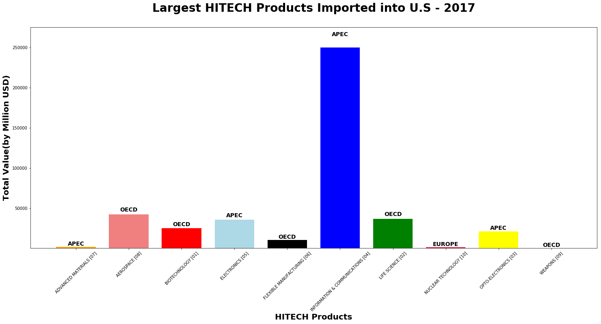

## International Trade - Export Graphs
## Eugene Miao


```python
import numpy as np
import pandas as pd
import matplotlib.pyplot as plt
import requests
from census import Census
import json
```


```python
#Export data for HITECH Products:

url_hitechex="https://api.census.gov/data/timeseries/intltrade/exports/hitech?get=CTY_CODE,CTY_NAME,HITECH,HITECH_DESC,ALL_VAL_MO,ALL_VAL_YR&time=from+2017-01+to+2017-12&key=f71e81f058685a925a2f209f4ae23944770802fa"
export_hitechdata= requests.get(url_hitechex).json()
#print(json.dumps(export_hitechdata, indent=4, sort_keys=True))
Export_hicountrycode=[]
Export_hicountryname=[]
Export_hitechcode=[]
Export_hitechname=[]
Export_hitotalvalue=[]
Export_hiyear_date_value=[]
Export_hitime=[]
i=1
while i <len(export_hitechdata):
    Export_hicountrycode.append(export_hitechdata[i][0])
    Export_hicountryname.append(export_hitechdata[i][1])
    Export_hitechcode.append(export_hitechdata[i][2])
    Export_hitechname.append(export_hitechdata[i][3])
    Export_hitotalvalue.append(int(export_hitechdata[i][4]))
    Export_hiyear_date_value.append(int(export_hitechdata[i][5]))
    Export_hitime.append(export_hitechdata[i][6])
    i= i+1
export_hitechdata_df= pd.DataFrame({"Country Code":Export_hicountrycode,"Country Name":Export_hicountryname,"Hitech code":Export_hitechcode,"Hitech Name":Export_hitechname,"Total Value":Export_hitotalvalue,"Year to Date Total Value":Export_hiyear_date_value,"Time":Export_hitime})
export_hitechdata_df.head()
```


<div>
<style scoped>
    .dataframe tbody tr th:only-of-type {
        vertical-align: middle;
    }

    .dataframe tbody tr th {
        vertical-align: top;
    }

    .dataframe thead th {
        text-align: right;
    }
</style>
<table border="1" class="dataframe">
  <thead>
    <tr style="text-align: right;">
      <th></th>
      <th>Country Code</th>
      <th>Country Name</th>
      <th>Hitech Name</th>
      <th>Hitech code</th>
      <th>Time</th>
      <th>Total Value</th>
      <th>Year to Date Total Value</th>
    </tr>
  </thead>
  <tbody>
    <tr>
      <th>0</th>
      <td></td>
      <td>TOTAL FOR ALL COUNTRIES</td>
      <td>TOTAL FOR ALL COMMODITIES</td>
      <td></td>
      <td>2017-01</td>
      <td>117458099885</td>
      <td>117458099885</td>
    </tr>
    <tr>
      <th>1</th>
      <td></td>
      <td>TOTAL FOR ALL COUNTRIES</td>
      <td>TOTAL FOR ALL COMMODITIES</td>
      <td></td>
      <td>2017-02</td>
      <td>119251603769</td>
      <td>236709703654</td>
    </tr>
    <tr>
      <th>2</th>
      <td></td>
      <td>TOTAL FOR ALL COUNTRIES</td>
      <td>TOTAL FOR ALL COMMODITIES</td>
      <td></td>
      <td>2017-03</td>
      <td>135904939630</td>
      <td>372614643284</td>
    </tr>
    <tr>
      <th>3</th>
      <td></td>
      <td>TOTAL FOR ALL COUNTRIES</td>
      <td>TOTAL FOR ALL COMMODITIES</td>
      <td></td>
      <td>2017-04</td>
      <td>123841552401</td>
      <td>496456195685</td>
    </tr>
    <tr>
      <th>4</th>
      <td></td>
      <td>TOTAL FOR ALL COUNTRIES</td>
      <td>TOTAL FOR ALL COMMODITIES</td>
      <td></td>
      <td>2017-05</td>
      <td>127781985882</td>
      <td>624238181567</td>
    </tr>
  </tbody>
</table>
</div>


```python
#as Hitech Products start with code 01-10 so have to clean the data 
hitechex_df=export_hitechdata_df[(export_hitechdata_df["Hitech code"] !="") & (export_hitechdata_df["Hitech code"] !="00") & (export_hitechdata_df["Country Name"] !="TOTAL FOR ALL COUNTRIES")]
#hitech_df.head(150)
#Group by Hitech Code, Hitech Name and Country Name to find largest hitech products export to U.S in 2017
hitechex_group=hitechex_df.groupby(["Hitech code","Country Name","Hitech Name"]).sum()
#hitech_group.head(200)
hitechex_group.reset_index(inplace=True)

#Find largest hitech products imports into US,2017
bioim_largest_ex = hitechex_group[hitechex_group["Hitech Name"] == "BIOTECHNOLOGY [01]"].nlargest(1,'Total Value')
lifescim_largest_ex = hitechex_group[hitechex_group["Hitech Name"] == "LIFE SCIENCE [02]"].nlargest(1,'Total Value')
optoim_largest_ex = hitechex_group[hitechex_group["Hitech Name"] == "OPTO-ELECTRONICS [03]"].nlargest(1,'Total Value')
ictim_largest_ex = hitechex_group[hitechex_group["Hitech Name"] == "INFORMATION & COMMUNICATIONS [04]"].nlargest(1,'Total Value')
elecim_largest_ex = hitechex_group[hitechex_group["Hitech Name"] == "ELECTRONICS [05]"].nlargest(1,'Total Value')
flexim_largest_ex = hitechex_group[hitechex_group["Hitech Name"] == "FLEXIBLE MANUFACTURING [06]"].nlargest(1,'Total Value')
advmatim_largest_ex = hitechex_group[hitechex_group["Hitech Name"] == "ADVANCED MATERIALS [07]"].nlargest(1,'Total Value')
aeroim_largest_ex = hitechex_group[hitechex_group["Hitech Name"] == "AEROSPACE [08]"].nlargest(1,'Total Value')
wpim_largest_ex = hitechex_group[hitechex_group["Hitech Name"] == "WEAPONS [09]"].nlargest(1,'Total Value')
nuclim_largest_ex = hitechex_group[hitechex_group["Hitech Name"] == "NUCLEAR TECHNOLOGY [10]"].nlargest(1,'Total Value')

largestex =pd.concat([bioim_largest_ex,lifescim_largest_ex,optoim_largest_ex,ictim_largest_ex,elecim_largest_ex,flexim_largest_ex,advmatim_largest_ex,aeroim_largest_ex,wpim_largest_ex,nuclim_largest_ex])
largestex["Total Value"] = round(largestex["Total Value"]/1000000,2)
largestex
```


<div>
<style scoped>
    .dataframe tbody tr th:only-of-type {
        vertical-align: middle;
    }

    .dataframe tbody tr th {
        vertical-align: top;
    }

    .dataframe thead th {
        text-align: right;
    }
</style>
<table border="1" class="dataframe">
  <thead>
    <tr style="text-align: right;">
      <th></th>
      <th>Hitech code</th>
      <th>Country Name</th>
      <th>Hitech Name</th>
      <th>Total Value</th>
      <th>Year to Date Total Value</th>
    </tr>
  </thead>
  <tbody>
    <tr>
      <th>123</th>
      <td>01</td>
      <td>OECD</td>
      <td>BIOTECHNOLOGY [01]</td>
      <td>16400.33</td>
      <td>112202738578</td>
    </tr>
    <tr>
      <th>340</th>
      <td>02</td>
      <td>OECD</td>
      <td>LIFE SCIENCE [02]</td>
      <td>19812.53</td>
      <td>126913831880</td>
    </tr>
    <tr>
      <th>422</th>
      <td>03</td>
      <td>APEC</td>
      <td>OPTO-ELECTRONICS [03]</td>
      <td>3133.41</td>
      <td>19894939004</td>
    </tr>
    <tr>
      <th>631</th>
      <td>04</td>
      <td>APEC</td>
      <td>INFORMATION &amp; COMMUNICATIONS [04]</td>
      <td>62621.98</td>
      <td>394930667051</td>
    </tr>
    <tr>
      <th>874</th>
      <td>05</td>
      <td>APEC</td>
      <td>ELECTRONICS [05]</td>
      <td>40635.28</td>
      <td>260450184270</td>
    </tr>
    <tr>
      <th>1089</th>
      <td>06</td>
      <td>APEC</td>
      <td>FLEXIBLE MANUFACTURING [06]</td>
      <td>16840.08</td>
      <td>107706326837</td>
    </tr>
    <tr>
      <th>1413</th>
      <td>07</td>
      <td>OECD</td>
      <td>ADVANCED MATERIALS [07]</td>
      <td>1918.70</td>
      <td>12612455268</td>
    </tr>
    <tr>
      <th>1623</th>
      <td>08</td>
      <td>OECD</td>
      <td>AEROSPACE [08]</td>
      <td>74039.54</td>
      <td>470675439044</td>
    </tr>
    <tr>
      <th>1706</th>
      <td>09</td>
      <td>ASIA</td>
      <td>WEAPONS [09]</td>
      <td>3108.54</td>
      <td>16780711578</td>
    </tr>
    <tr>
      <th>1847</th>
      <td>10</td>
      <td>APEC</td>
      <td>NUCLEAR TECHNOLOGY [10]</td>
      <td>602.33</td>
      <td>4668818147</td>
    </tr>
  </tbody>
</table>
</div>


```python
#Ensure all export HS codes are properly added into a DataFrame
df = pd.read_csv('Aerospace.csv')

Exportdetail_totalvalue=[]
Exportdetail_time=[]
Exportdetail_CTYNAME=[]
Hitechdetail=[]
Hitechdetaildesc=[]

print(len(df))
for i in range(len(df)):
    checkerror = False
    check=df["Aerospace code"][i]
    try:
        export_datacode = requests.get(f"https://api.census.gov/data/timeseries/intltrade/exports/hs?get=CTY_CODE,CTY_NAME,ALL_VAL_MO&time=2017&CTY_NAME=OECD&E_COMMODITY={check}&key=f71e81f058685a925a2f209f4ae23944770802fa").json()
    except Exception:
        checkerror = True
        print("Aerospace code is error or null of value")
    if checkerror == False :
        c=1
        while c < len(export_datacode):
            Hitechdetaildesc.append(df["Aerospace desc"][i])
            Exportdetail_totalvalue.append(int(export_datacode[c][2]))
            Exportdetail_time.append(export_datacode[c][3])
            Exportdetail_CTYNAME.append(export_datacode[c][4])
            Hitechdetail.append(export_datacode[c][5])
            c=c+1
export_hitechdetails= pd.DataFrame({"Hitech detail Code":Hitechdetail,"Hitech detail desc":Hitechdetaildesc,"Country Name":Exportdetail_CTYNAME,"Total Value":Exportdetail_totalvalue,"Time":Exportdetail_time})

print(sum(Exportdetail_totalvalue))
export_hitechdetails.head()
```

    52
    Aerospace code is error or null of value
    Aerospace code is error or null of value
    Aerospace code is error or null of value
    Aerospace code is error or null of value
    Aerospace code is error or null of value
    Aerospace code is error or null of value
    Aerospace code is error or null of value
    Aerospace code is error or null of value
    Aerospace code is error or null of value
    Aerospace code is error or null of value
    Aerospace code is error or null of value
    Aerospace code is error or null of value
    Aerospace code is error or null of value
    Aerospace code is error or null of value
    Aerospace code is error or null of value
    Aerospace code is error or null of value
    Aerospace code is error or null of value
    Aerospace code is error or null of value
    Aerospace code is error or null of value
    Aerospace code is error or null of value
    Aerospace code is error or null of value
    Aerospace code is error or null of value
    Aerospace code is error or null of value
    Aerospace code is error or null of value
    Aerospace code is error or null of value
    Aerospace code is error or null of value
    Aerospace code is error or null of value
    Aerospace code is error or null of value
    Aerospace code is error or null of value
    Aerospace code is error or null of value
    Aerospace code is error or null of value
    Aerospace code is error or null of value
    Aerospace code is error or null of value
    Aerospace code is error or null of value
    73777590063
    


<div>
<style scoped>
    .dataframe tbody tr th:only-of-type {
        vertical-align: middle;
    }

    .dataframe tbody tr th {
        vertical-align: top;
    }

    .dataframe thead th {
        text-align: right;
    }
</style>
<table border="1" class="dataframe">
  <thead>
    <tr style="text-align: right;">
      <th></th>
      <th>Country Name</th>
      <th>Hitech detail Code</th>
      <th>Hitech detail desc</th>
      <th>Time</th>
      <th>Total Value</th>
    </tr>
  </thead>
  <tbody>
    <tr>
      <th>0</th>
      <td>OECD</td>
      <td>8411814050</td>
      <td>GAS TURBINE A/C TBN EXC CIVIL, 5000 KW AND UNDER</td>
      <td>2017-01</td>
      <td>3002584</td>
    </tr>
    <tr>
      <th>1</th>
      <td>OECD</td>
      <td>8411814050</td>
      <td>GAS TURBINE A/C TBN EXC CIVIL, 5000 KW AND UNDER</td>
      <td>2017-02</td>
      <td>4862673</td>
    </tr>
    <tr>
      <th>2</th>
      <td>OECD</td>
      <td>8411814050</td>
      <td>GAS TURBINE A/C TBN EXC CIVIL, 5000 KW AND UNDER</td>
      <td>2017-03</td>
      <td>1517736</td>
    </tr>
    <tr>
      <th>3</th>
      <td>OECD</td>
      <td>8411814050</td>
      <td>GAS TURBINE A/C TBN EXC CIVIL, 5000 KW AND UNDER</td>
      <td>2017-04</td>
      <td>4524940</td>
    </tr>
    <tr>
      <th>4</th>
      <td>OECD</td>
      <td>8411814050</td>
      <td>GAS TURBINE A/C TBN EXC CIVIL, 5000 KW AND UNDER</td>
      <td>2017-05</td>
      <td>3881572</td>
    </tr>
  </tbody>
</table>
</div>


```python
#Further breakdown the dataframe into only the Hitech detail code, Hitech detail description, and Total Value
export_hitechdetails.to_csv('export_hs_2017.csv', encoding='utf-8', index=False)

aerodetail_plot = export_hitechdetails.groupby(["Hitech detail Code","Hitech detail desc"]).sum()
aerodetail_plot.reset_index(inplace=True)

top10Aeroproducts = aerodetail_plot.nlargest(10,'Total Value')
top10Aeroproducts
```


<div>
<style scoped>
    .dataframe tbody tr th:only-of-type {
        vertical-align: middle;
    }

    .dataframe tbody tr th {
        vertical-align: top;
    }

    .dataframe thead th {
        text-align: right;
    }
</style>
<table border="1" class="dataframe">
  <thead>
    <tr style="text-align: right;">
      <th></th>
      <th>Hitech detail Code</th>
      <th>Hitech detail desc</th>
      <th>Total Value</th>
    </tr>
  </thead>
  <tbody>
    <tr>
      <th>5</th>
      <td>8800000000</td>
      <td>CIVILIAN AIRCRAFT, ENGINES, EQUIPMENT, AND PARTS</td>
      <td>66522004223</td>
    </tr>
    <tr>
      <th>13</th>
      <td>8803300060</td>
      <td>OTHER PARTS,NESOI,OF MILITARY AIRPLANES/HELICO...</td>
      <td>3081123148</td>
    </tr>
    <tr>
      <th>2</th>
      <td>8411917050</td>
      <td>PARTS OF TURBOJET &amp; TURBOPROPELLR A/C ENG,EX C...</td>
      <td>1053078387</td>
    </tr>
    <tr>
      <th>3</th>
      <td>8411997050</td>
      <td>PARTS OF GAS TURBINE A/C ENG, EXC CIVIL A/C</td>
      <td>661104074</td>
    </tr>
    <tr>
      <th>6</th>
      <td>8802120020</td>
      <td>NEW HELICOPTERS, MILITARY, UNLAD WGT &gt; 2,000 KG</td>
      <td>561534070</td>
    </tr>
    <tr>
      <th>7</th>
      <td>8802300010</td>
      <td>NEW MILITARY AIRCRAFT FIGHTERS,WT(2000-15000 KG)</td>
      <td>539579448</td>
    </tr>
    <tr>
      <th>9</th>
      <td>8802400020</td>
      <td>NEW MILITARY CARGO TRANSPORTS,WEIGHT GT 15,000 KG</td>
      <td>254562565</td>
    </tr>
    <tr>
      <th>16</th>
      <td>9014208080</td>
      <td>INST &amp; APPLN, AERONAUTICAL/SPACE NAVIGATION, N...</td>
      <td>241422580</td>
    </tr>
    <tr>
      <th>11</th>
      <td>8803100060</td>
      <td>PROPLLRS &amp; ROTORS &amp; PRTS THEREOF FOR MLTARY AI...</td>
      <td>164125134</td>
    </tr>
    <tr>
      <th>12</th>
      <td>8803200060</td>
      <td>UNDERCARRIAGES &amp; PARTS THEREOF FOR MILITRY AIR...</td>
      <td>158285767</td>
    </tr>
  </tbody>
</table>
</div>


```python
#Identify the top 10 products
top10index = top10Aeroproducts[['Hitech detail Code']]
top10index
```


<div>
<style scoped>
    .dataframe tbody tr th:only-of-type {
        vertical-align: middle;
    }

    .dataframe tbody tr th {
        vertical-align: top;
    }

    .dataframe thead th {
        text-align: right;
    }
</style>
<table border="1" class="dataframe">
  <thead>
    <tr style="text-align: right;">
      <th></th>
      <th>Hitech detail Code</th>
    </tr>
  </thead>
  <tbody>
    <tr>
      <th>5</th>
      <td>8800000000</td>
    </tr>
    <tr>
      <th>13</th>
      <td>8803300060</td>
    </tr>
    <tr>
      <th>2</th>
      <td>8411917050</td>
    </tr>
    <tr>
      <th>3</th>
      <td>8411997050</td>
    </tr>
    <tr>
      <th>6</th>
      <td>8802120020</td>
    </tr>
    <tr>
      <th>7</th>
      <td>8802300010</td>
    </tr>
    <tr>
      <th>9</th>
      <td>8802400020</td>
    </tr>
    <tr>
      <th>16</th>
      <td>9014208080</td>
    </tr>
    <tr>
      <th>11</th>
      <td>8803100060</td>
    </tr>
    <tr>
      <th>12</th>
      <td>8803200060</td>
    </tr>
  </tbody>
</table>
</div>


```python
#Merge all values from the top 10 products
merged_top10 = pd.merge(top10index, export_hitechdetails, on = 'Hitech detail Code', how='left')
merged_top10[['Hitech detail Code', 'Hitech detail desc', 'Time', 'Total Value']]

#Create a pivot table for ease of review
df = merged_top10.pivot('Time', 'Hitech detail desc', 'Total Value')
df
```


<div>
<style scoped>
    .dataframe tbody tr th:only-of-type {
        vertical-align: middle;
    }

    .dataframe tbody tr th {
        vertical-align: top;
    }

    .dataframe thead th {
        text-align: right;
    }
</style>
<table border="1" class="dataframe">
  <thead>
    <tr style="text-align: right;">
      <th>Hitech detail desc</th>
      <th>CIVILIAN AIRCRAFT, ENGINES, EQUIPMENT, AND PARTS</th>
      <th>INST &amp; APPLN, AERONAUTICAL/SPACE NAVIGATION, NESOI</th>
      <th>NEW HELICOPTERS, MILITARY, UNLAD WGT &gt; 2,000 KG</th>
      <th>NEW MILITARY AIRCRAFT FIGHTERS,WT(2000-15000 KG)</th>
      <th>NEW MILITARY CARGO TRANSPORTS,WEIGHT GT 15,000 KG</th>
      <th>OTHER PARTS,NESOI,OF MILITARY AIRPLANES/HELICOPTRS</th>
      <th>PARTS OF GAS TURBINE A/C ENG, EXC CIVIL A/C</th>
      <th>PARTS OF TURBOJET &amp; TURBOPROPELLR A/C ENG,EX CIVIL</th>
      <th>PROPLLRS &amp; ROTORS &amp; PRTS THEREOF FOR MLTARY AIRCFT</th>
      <th>UNDERCARRIAGES &amp; PARTS THEREOF FOR MILITRY AIRCRFT</th>
    </tr>
    <tr>
      <th>Time</th>
      <th></th>
      <th></th>
      <th></th>
      <th></th>
      <th></th>
      <th></th>
      <th></th>
      <th></th>
      <th></th>
      <th></th>
    </tr>
  </thead>
  <tbody>
    <tr>
      <th>2017-01</th>
      <td>4.802495e+09</td>
      <td>17894273.0</td>
      <td>107799472.0</td>
      <td>NaN</td>
      <td>NaN</td>
      <td>202943451.0</td>
      <td>47296948.0</td>
      <td>94571651.0</td>
      <td>11267516.0</td>
      <td>11520151.0</td>
    </tr>
    <tr>
      <th>2017-02</th>
      <td>4.894495e+09</td>
      <td>19700194.0</td>
      <td>24345697.0</td>
      <td>179859816.0</td>
      <td>NaN</td>
      <td>256633641.0</td>
      <td>35649327.0</td>
      <td>63153928.0</td>
      <td>12110522.0</td>
      <td>12164871.0</td>
    </tr>
    <tr>
      <th>2017-03</th>
      <td>5.978378e+09</td>
      <td>22270497.0</td>
      <td>170910987.0</td>
      <td>134894862.0</td>
      <td>31649564.0</td>
      <td>273348394.0</td>
      <td>105661281.0</td>
      <td>85186934.0</td>
      <td>15173142.0</td>
      <td>17410168.0</td>
    </tr>
    <tr>
      <th>2017-04</th>
      <td>5.614973e+09</td>
      <td>21123439.0</td>
      <td>24345697.0</td>
      <td>0.0</td>
      <td>63346471.0</td>
      <td>261992407.0</td>
      <td>63013224.0</td>
      <td>71899155.0</td>
      <td>14111516.0</td>
      <td>12971897.0</td>
    </tr>
    <tr>
      <th>2017-05</th>
      <td>5.376678e+09</td>
      <td>17810548.0</td>
      <td>102109825.0</td>
      <td>134894862.0</td>
      <td>0.0</td>
      <td>280612461.0</td>
      <td>42042019.0</td>
      <td>89069067.0</td>
      <td>18640226.0</td>
      <td>8927704.0</td>
    </tr>
    <tr>
      <th>2017-06</th>
      <td>5.123417e+09</td>
      <td>21111881.0</td>
      <td>0.0</td>
      <td>89929908.0</td>
      <td>31649564.0</td>
      <td>296476505.0</td>
      <td>84472216.0</td>
      <td>93783533.0</td>
      <td>11843756.0</td>
      <td>15414121.0</td>
    </tr>
    <tr>
      <th>2017-07</th>
      <td>5.444838e+09</td>
      <td>20292797.0</td>
      <td>48691394.0</td>
      <td>0.0</td>
      <td>0.0</td>
      <td>231657039.0</td>
      <td>38442710.0</td>
      <td>73198381.0</td>
      <td>10903309.0</td>
      <td>13954925.0</td>
    </tr>
    <tr>
      <th>2017-08</th>
      <td>5.362537e+09</td>
      <td>17445615.0</td>
      <td>0.0</td>
      <td>0.0</td>
      <td>0.0</td>
      <td>221848883.0</td>
      <td>37891204.0</td>
      <td>75987054.0</td>
      <td>11801767.0</td>
      <td>10219131.0</td>
    </tr>
    <tr>
      <th>2017-09</th>
      <td>5.910992e+09</td>
      <td>19428758.0</td>
      <td>0.0</td>
      <td>0.0</td>
      <td>0.0</td>
      <td>260026104.0</td>
      <td>63880539.0</td>
      <td>100362542.0</td>
      <td>14444046.0</td>
      <td>12275493.0</td>
    </tr>
    <tr>
      <th>2017-10</th>
      <td>6.126368e+09</td>
      <td>16041628.0</td>
      <td>83330998.0</td>
      <td>0.0</td>
      <td>0.0</td>
      <td>280134207.0</td>
      <td>30531626.0</td>
      <td>74723151.0</td>
      <td>11660287.0</td>
      <td>13595756.0</td>
    </tr>
    <tr>
      <th>2017-11</th>
      <td>5.904281e+09</td>
      <td>20868874.0</td>
      <td>0.0</td>
      <td>0.0</td>
      <td>31649564.0</td>
      <td>233920654.0</td>
      <td>36376383.0</td>
      <td>111740748.0</td>
      <td>12590234.0</td>
      <td>12746587.0</td>
    </tr>
    <tr>
      <th>2017-12</th>
      <td>5.982551e+09</td>
      <td>27434076.0</td>
      <td>0.0</td>
      <td>0.0</td>
      <td>96267402.0</td>
      <td>281529402.0</td>
      <td>75846597.0</td>
      <td>119402243.0</td>
      <td>19578813.0</td>
      <td>17084963.0</td>
    </tr>
  </tbody>
</table>
</div>


```python
#Create list of products to loop through, essentially the columns
products = list(df.columns)
products
```


    ['CIVILIAN AIRCRAFT, ENGINES, EQUIPMENT, AND PARTS',
     'INST & APPLN, AERONAUTICAL/SPACE NAVIGATION, NESOI',
     'NEW HELICOPTERS, MILITARY, UNLAD WGT > 2,000 KG',
     'NEW MILITARY AIRCRAFT FIGHTERS,WT(2000-15000 KG)',
     'NEW MILITARY CARGO TRANSPORTS,WEIGHT GT 15,000 KG',
     'OTHER PARTS,NESOI,OF MILITARY AIRPLANES/HELICOPTRS',
     'PARTS OF GAS TURBINE A/C ENG, EXC CIVIL A/C',
     'PARTS OF TURBOJET & TURBOPROPELLR A/C ENG,EX CIVIL',
     'PROPLLRS & ROTORS & PRTS THEREOF FOR MLTARY AIRCFT',
     'UNDERCARRIAGES & PARTS THEREOF FOR MILITRY AIRCRFT']


```python
df['CIVILIAN AIRCRAFT, ENGINES, EQUIPMENT, AND PARTS']
```


    Time
    2017-01    4.802495e+09
    2017-02    4.894495e+09
    2017-03    5.978378e+09
    2017-04    5.614973e+09
    2017-05    5.376678e+09
    2017-06    5.123417e+09
    2017-07    5.444838e+09
    2017-08    5.362537e+09
    2017-09    5.910992e+09
    2017-10    6.126368e+09
    2017-11    5.904281e+09
    2017-12    5.982551e+09
    Name: CIVILIAN AIRCRAFT, ENGINES, EQUIPMENT, AND PARTS, dtype: float64


```python
df.index
```


    Index(['2017-01', '2017-02', '2017-03', '2017-04', '2017-05', '2017-06',
           '2017-07', '2017-08', '2017-09', '2017-10', '2017-11', '2017-12'],
          dtype='object', name='Time')


```python
#Plot top 10 Aerospace products by month

for product in products:
    plt.plot(df.index, df[product], label = product)

plt.xticks(rotation=45)
#plt.legend(loc = "best")
#plt.legend(loc='upper center', bbox_to_anchor=(0.5, -0.05), fancybox=True, shadow=True, ncol=5)
plt.legend(bbox_to_anchor=(1.04,1), loc="upper left")
plt.title('Top 10 Aerospace products by month')
plt.ylabel('Total Value (USD Billion)')
plt.xlabel('Months')
plt.savefig('export top 10.png', bbox_inches="tight")
plt.show()
```





```python
#Further breakdown the information, by splitting it to the Top 5 aerospace products
top5index = top10index[:5]

merged_top5 = pd.merge(top5index, export_hitechdetails, on = 'Hitech detail Code', how='left')
merged_top5[['Hitech detail Code', 'Hitech detail desc', 'Time', 'Total Value']]
merged_top5.head()
```


<div>
<style scoped>
    .dataframe tbody tr th:only-of-type {
        vertical-align: middle;
    }

    .dataframe tbody tr th {
        vertical-align: top;
    }

    .dataframe thead th {
        text-align: right;
    }
</style>
<table border="1" class="dataframe">
  <thead>
    <tr style="text-align: right;">
      <th></th>
      <th>Hitech detail Code</th>
      <th>Country Name</th>
      <th>Hitech detail desc</th>
      <th>Time</th>
      <th>Total Value</th>
    </tr>
  </thead>
  <tbody>
    <tr>
      <th>0</th>
      <td>8800000000</td>
      <td>OECD</td>
      <td>CIVILIAN AIRCRAFT, ENGINES, EQUIPMENT, AND PARTS</td>
      <td>2017-01</td>
      <td>4802494623</td>
    </tr>
    <tr>
      <th>1</th>
      <td>8800000000</td>
      <td>OECD</td>
      <td>CIVILIAN AIRCRAFT, ENGINES, EQUIPMENT, AND PARTS</td>
      <td>2017-02</td>
      <td>4894494810</td>
    </tr>
    <tr>
      <th>2</th>
      <td>8800000000</td>
      <td>OECD</td>
      <td>CIVILIAN AIRCRAFT, ENGINES, EQUIPMENT, AND PARTS</td>
      <td>2017-03</td>
      <td>5978378411</td>
    </tr>
    <tr>
      <th>3</th>
      <td>8800000000</td>
      <td>OECD</td>
      <td>CIVILIAN AIRCRAFT, ENGINES, EQUIPMENT, AND PARTS</td>
      <td>2017-04</td>
      <td>5614973041</td>
    </tr>
    <tr>
      <th>4</th>
      <td>8800000000</td>
      <td>OECD</td>
      <td>CIVILIAN AIRCRAFT, ENGINES, EQUIPMENT, AND PARTS</td>
      <td>2017-05</td>
      <td>5376678338</td>
    </tr>
  </tbody>
</table>
</div>


```python
#Among the top 5 products, identify the total value of each product by the month
count = 0
for product in list(top5index['Hitech detail Code']): 
    if count == 0:
        df_others = export_hitechdetails[export_hitechdetails['Hitech detail Code'] != product]
        count += 1
    else:
        df_others = df_others[df_others['Hitech detail Code'] != product]

df_others.head()
```


<div>
<style scoped>
    .dataframe tbody tr th:only-of-type {
        vertical-align: middle;
    }

    .dataframe tbody tr th {
        vertical-align: top;
    }

    .dataframe thead th {
        text-align: right;
    }
</style>
<table border="1" class="dataframe">
  <thead>
    <tr style="text-align: right;">
      <th></th>
      <th>Country Name</th>
      <th>Hitech detail Code</th>
      <th>Hitech detail desc</th>
      <th>Time</th>
      <th>Total Value</th>
    </tr>
  </thead>
  <tbody>
    <tr>
      <th>0</th>
      <td>OECD</td>
      <td>8411814050</td>
      <td>GAS TURBINE A/C TBN EXC CIVIL, 5000 KW AND UNDER</td>
      <td>2017-01</td>
      <td>3002584</td>
    </tr>
    <tr>
      <th>1</th>
      <td>OECD</td>
      <td>8411814050</td>
      <td>GAS TURBINE A/C TBN EXC CIVIL, 5000 KW AND UNDER</td>
      <td>2017-02</td>
      <td>4862673</td>
    </tr>
    <tr>
      <th>2</th>
      <td>OECD</td>
      <td>8411814050</td>
      <td>GAS TURBINE A/C TBN EXC CIVIL, 5000 KW AND UNDER</td>
      <td>2017-03</td>
      <td>1517736</td>
    </tr>
    <tr>
      <th>3</th>
      <td>OECD</td>
      <td>8411814050</td>
      <td>GAS TURBINE A/C TBN EXC CIVIL, 5000 KW AND UNDER</td>
      <td>2017-04</td>
      <td>4524940</td>
    </tr>
    <tr>
      <th>4</th>
      <td>OECD</td>
      <td>8411814050</td>
      <td>GAS TURBINE A/C TBN EXC CIVIL, 5000 KW AND UNDER</td>
      <td>2017-05</td>
      <td>3881572</td>
    </tr>
  </tbody>
</table>
</div>


```python
#Sum the other Aerospace products that didn't make the top 5
df_others_sum = df_others.groupby('Time')['Total Value'].sum()
df_others_sum
```


    Time
    2017-01     68102431
    2017-02    240293425
    2017-03    241270334
    2017-04    218385621
    2017-05    228464927
    2017-06    211425995
    2017-07    102174367
    2017-08     89408229
    2017-09     98723761
    2017-10     73739810
    2017-11    110827984
    2017-12    215929277
    Name: Total Value, dtype: int64


```python
#create pivot table for ease of understanding and preparation of graph
df_top5 = merged_top5.pivot('Time', 'Hitech detail desc', 'Total Value')
df_top5['Others'] = df_others_sum
df_top5
```


<div>
<style scoped>
    .dataframe tbody tr th:only-of-type {
        vertical-align: middle;
    }

    .dataframe tbody tr th {
        vertical-align: top;
    }

    .dataframe thead th {
        text-align: right;
    }
</style>
<table border="1" class="dataframe">
  <thead>
    <tr style="text-align: right;">
      <th>Hitech detail desc</th>
      <th>CIVILIAN AIRCRAFT, ENGINES, EQUIPMENT, AND PARTS</th>
      <th>NEW HELICOPTERS, MILITARY, UNLAD WGT &gt; 2,000 KG</th>
      <th>OTHER PARTS,NESOI,OF MILITARY AIRPLANES/HELICOPTRS</th>
      <th>PARTS OF GAS TURBINE A/C ENG, EXC CIVIL A/C</th>
      <th>PARTS OF TURBOJET &amp; TURBOPROPELLR A/C ENG,EX CIVIL</th>
      <th>Others</th>
    </tr>
    <tr>
      <th>Time</th>
      <th></th>
      <th></th>
      <th></th>
      <th></th>
      <th></th>
      <th></th>
    </tr>
  </thead>
  <tbody>
    <tr>
      <th>2017-01</th>
      <td>4802494623</td>
      <td>107799472</td>
      <td>202943451</td>
      <td>47296948</td>
      <td>94571651</td>
      <td>68102431</td>
    </tr>
    <tr>
      <th>2017-02</th>
      <td>4894494810</td>
      <td>24345697</td>
      <td>256633641</td>
      <td>35649327</td>
      <td>63153928</td>
      <td>240293425</td>
    </tr>
    <tr>
      <th>2017-03</th>
      <td>5978378411</td>
      <td>170910987</td>
      <td>273348394</td>
      <td>105661281</td>
      <td>85186934</td>
      <td>241270334</td>
    </tr>
    <tr>
      <th>2017-04</th>
      <td>5614973041</td>
      <td>24345697</td>
      <td>261992407</td>
      <td>63013224</td>
      <td>71899155</td>
      <td>218385621</td>
    </tr>
    <tr>
      <th>2017-05</th>
      <td>5376678338</td>
      <td>102109825</td>
      <td>280612461</td>
      <td>42042019</td>
      <td>89069067</td>
      <td>228464927</td>
    </tr>
    <tr>
      <th>2017-06</th>
      <td>5123417276</td>
      <td>0</td>
      <td>296476505</td>
      <td>84472216</td>
      <td>93783533</td>
      <td>211425995</td>
    </tr>
    <tr>
      <th>2017-07</th>
      <td>5444838314</td>
      <td>48691394</td>
      <td>231657039</td>
      <td>38442710</td>
      <td>73198381</td>
      <td>102174367</td>
    </tr>
    <tr>
      <th>2017-08</th>
      <td>5362537229</td>
      <td>0</td>
      <td>221848883</td>
      <td>37891204</td>
      <td>75987054</td>
      <td>89408229</td>
    </tr>
    <tr>
      <th>2017-09</th>
      <td>5910992258</td>
      <td>0</td>
      <td>260026104</td>
      <td>63880539</td>
      <td>100362542</td>
      <td>98723761</td>
    </tr>
    <tr>
      <th>2017-10</th>
      <td>6126367504</td>
      <td>83330998</td>
      <td>280134207</td>
      <td>30531626</td>
      <td>74723151</td>
      <td>73739810</td>
    </tr>
    <tr>
      <th>2017-11</th>
      <td>5904281036</td>
      <td>0</td>
      <td>233920654</td>
      <td>36376383</td>
      <td>111740748</td>
      <td>110827984</td>
    </tr>
    <tr>
      <th>2017-12</th>
      <td>5982551383</td>
      <td>0</td>
      <td>281529402</td>
      <td>75846597</td>
      <td>119402243</td>
      <td>215929277</td>
    </tr>
  </tbody>
</table>
</div>


```python
#Generate Monthly Export Value by Product graph, measuring how the top 5 items did comparatively
#as a whole for each export month

import seaborn as sns

sns.set()
#df_top5.set_index('ICT detail desc').T.plot(kind='bar', stacked=True)
df_top5.plot(kind='bar', stacked=True)
plt.legend(bbox_to_anchor=(1.04,1), loc="upper left")
plt.xticks(rotation=45)
plt.title('Monthly Export Value by Product')
plt.xlabel('Months')
plt.ylabel('Monthly Export Value')
plt.savefig('Monthly Export Volume.png', bbox_inches = "tight")
```


